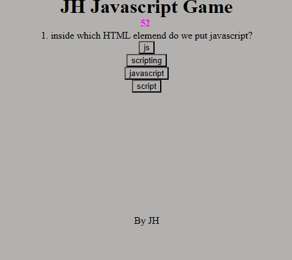

# this-is-a-game-JH
references:
https://www.w3schools.com/
https://www.youtube.com/watch?v=PBcqGxrr9g8&t=1749s&ab_channel=GreatStack
from 04-22 in class work

a java script quiz(game) where you try to get a high score with correctly answered questions
you start the quiz by clicking the start button and select answers, next button traverses to next set questions and answers. there is a 120 second timer, each wrong answer reduces the timer by 15 seconds. once the quiz is over, you can save your nickname and it will be displayed to the next player to play the game along with your score. 

It was frustrating to work on this project, but the end result is something that i am reasonably satisfied with.
I enjoyed learning about time functions and passing data to functions with parameters. i think my favorite thing about the app is the reset button at the end... it's simple but works and was the least frustrating to code. 

here is a picture of the website and links. 

https://github.com/lilcobby/this-is-a-game-JH

https://lilcobby.github.io/this-is-a-game-JH/

